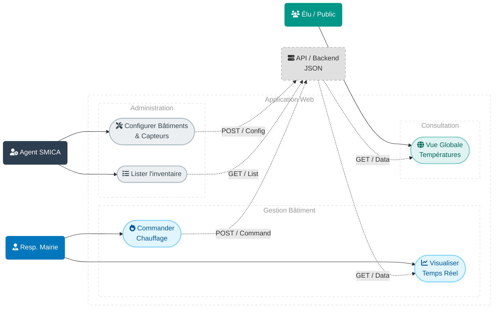
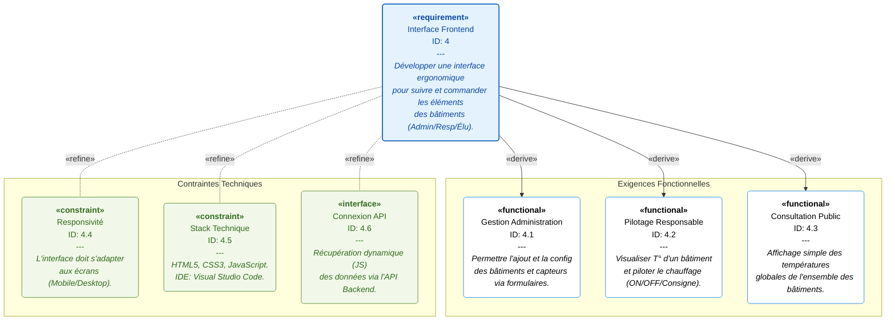

# Louna Le Bot--Davoust : Interface Frontend

## Missions
* Conception des maquettes pour les profils Admin, Responsable et Élu.
* Développement des interfaces web en HTML, CSS et JavaScript.
* Mise en œuvre de la responsivité pour une consultation sur tablette/mobile.
* Intégration dynamique des données via des appels API au backend.

## Stack Technique
- Langages : HTML5, CSS3, JavaScript.
- IDE : Visual Studio Code.

